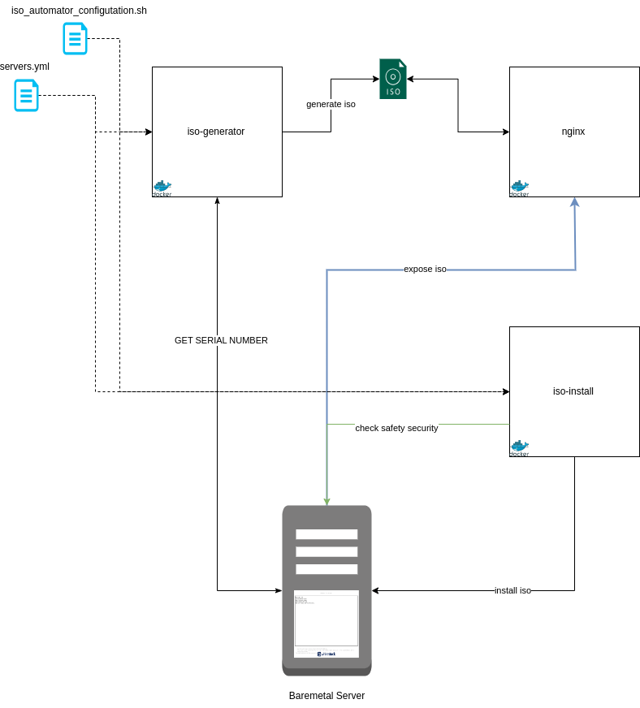
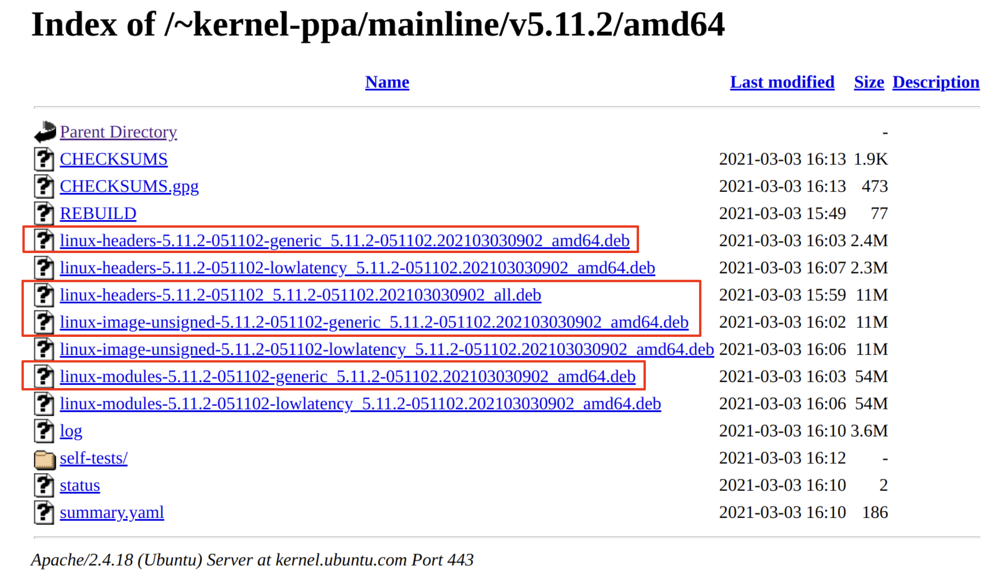

# ISO-Automator

## Introduction

ISO-Automator is responsible for carrying out and managing Ubuntu installations, replacing the ProvisioningManager in all cases.

ISO-Automator performs a complete installation of Ubuntu on a server without the need for human interaction, all through HTTP.

## Build

### Build Docker Image for iso-generator:

1. Edit the env.sh file. Replace <my_repository> with your Docker repository.
2. Grant execution permissions to the build.sh file by running:
   ```shell
      chmod +x build.sh
   ```
3. Execute the script with the following command:
   ```shell
      ./build.sh --tag <my_tag>
   ```
   Replace <my_tag> with your desired tag.

### Build Docker Image for iso-installer:

Follow the same steps to build the Docker image for iso-installer.

## Danger

- Currently, ISO-Automator **only** supports automatic installation on HP, DELL, and xFusion servers.
- The minimum version of Docker required for the deployment commands to work with `docker compose` is `20.10.0`, while 
the minimum version of `compose` is `v2.3.4`.
- In case you have a lower Docker version, the installation script will upgrade Docker but will remove the previous version, 
so you should be careful when running the script.

## Architecture



## Required Files

All these files go in the environment that will execute the ISO-Automator script (`/etc/iso-automator/`).

### Ubuntu Images

#### Image Location

Ubuntu images must be placed in the following directory: `/etc/iso-automator/base_image/`

#### Version Support

Currently, we provide technical support and ensure compatibility only for the following versions of Ubuntu Live Server:

- Ubuntu 20.04 Live Server
- Ubuntu 22.04 Live Server

###### Warning

If a different version of the base image of Ubuntu is required, please report it to the product area to evaluate 
the possibility of support. This will allow us to ensure compatibility and provide the appropriate assistance.

#### Ubuntu 20.04 Live Server

The Ubuntu 20.04 Live Server image can be downloaded from the following [link](https://old-releases.ubuntu.com/releases/20.04/ubuntu-20.04.4-live-server-amd64.iso).

#### Ubuntu 22.04 Live Server

The Ubuntu 22.04 Live Server image can be downloaded from the following [link](https://releases.ubuntu.com/jammy/ubuntu-22.04.4-live-server-amd64.iso).

### Kernel

ISO-Automator allows installing a specific version of the kernel 

Kernel files must be located in `/etc/iso-automator/kernel-vX.X.X`.

For example, the Kernel can be downloaded from this [link](https://kernel.ubuntu.com/~kernel-ppa/mainline/). The following .deb 
files should be chosen (refer to the image below).



They can be downloaded from [here](https://storage.googleapis.com/storage.whitestack.com/ISO_automator/kernels/kernel-v5.10.59.tar.gz).

### Files 

#### servers.yml

The `servers.yml` file defines the options for each node. The file must be located in `/etc/iso-automator/`.

Here is an example of the file:

```yaml
servers:
  computes:
  - COMPUTE-1: 
      management:
        address: 10.218.13.67
      netplan:
        - bond: bondC
          interface_position: [1,3]
          interface_type: pci
          parameters:
            mode: '802.3ad'
          vlans:
            - id: 102
              ip_address: 10.218.14.67
              netmask: 24
              gateway: 10.218.14.1
configuration:
  default:
    management:
      type: ilo
      user: usertest
      password: passtest
    apt:
      source_list: |
        deb http://nova.clouds.archive.ubuntu.com/ubuntu/ focal main restricted
        deb http://nova.clouds.archive.ubuntu.com/ubuntu/ focal-updates main restricted
        deb http://nova.clouds.archive.ubuntu.com/ubuntu/ focal universe
        deb http://nova.clouds.archive.ubuntu.com/ubuntu/ focal-updates universe
        deb http://nova.clouds.archive.ubuntu.com/ubuntu/ focal multiverse
        deb http://nova.clouds.archive.ubuntu.com/ubuntu/ focal-updates multiverse
        deb http://nova.clouds.archive.ubuntu.com/ubuntu/ focal-backports main restricted universe multiverse
        deb http://security.ubuntu.com/ubuntu focal-security main restricted
        deb http://security.ubuntu.com/ubuntu focal-security universe
        deb http://security.ubuntu.com/ubuntu focal-security multiverse
      proxy_url: http://10.218.14.157:3142
    storage:
    - vg_name: vg-root
      disks:
      - sda
      - sdb
      raid_type: 1
      boot: uefi
      lvs:
        - name: lv-root
          size: 80GB
          fs_type: ext4
          mount: /
        - name: lv-logs
          size: 20GB
          fs_type: ext4
          mount: /var/log
        - name: lv-tmp
          size: 2GB
          fs_type: ext4
          mount: /var/tmp
        - name: lv-audit
          size: 5GB
          fs_type: ext4
          mount: /var/log/audit
    - vg_name: vg-wc
      disks:
        - sdd
        - sde
      raid_type: 1
      lvs:
        - name: lv-docker
          size: -1
          fs_type: ext4
          mount: /var/lib/docker
    users:
      - name: test
        password: test
        authorized_keys:
        - <public_key>
        sudoers: "ALL=(ALL) NOPASSWD:ALL"
    packages:
      apt:
        - net-tools
        - ipmitool
        - dmidecode
        - vim
      deb:
        - /etc/iso-automator/files/package_1.deb
        - /etc/iso-automator/package_2.deb
      pip:
        - requests
      repositories:
        - "deb [trusted=yes] http://linux.dell.com/repo/community/openmanage/11010/jammy jammy main"
    kernel_options:
      version: v5.10.59
      hugepages:
        size: 1G
        number: 722
        transparent: never
      dpdk:
        isolated_cpus: "2,54,3,55,28,80,29,81"
        modules:
          - vfio-pci
          - uio_pci_generic
          - igb_uio
    iso_options: 
      image_name: ubuntu-22.04.4-live-server-amd64.iso
    final_commands: |
      sudo mkdir -p /root/.config/pip
      echo '[global]' > /root/.config/pip/pip.conf
      echo 'index-url = http://10.218.14.157/simple' >> /root/.config/pip/pip.conf
      echo 'trusted-host = 10.218.14.157' >> /root/.config/pip/pip.conf
```

#### iso_automator_configuration.sh

This file contains environment variables used by the iso-automator server. Here go general configurations.

The file must be named `iso_automator_configuration.sh` and located in the same path as the script `run-iso-automator.sh`.

##### SERVER_URL

This is a mandatory variable that must be specified in the `iso_automator_configuration.sh` file in order to 
be used as a URL and to set up the nginx server.
The port is optional.

````bash
SERVER_URL="https://10.218.13.157:<port optional>" # or "http:10.218.13.157:<port optional>"
````

##### Note

Make sure that the port is enabled to receive requests in the security group.

##### PROMETHEUS_URL

ISO-Automator will verify with a Prometheus instance that there are no metrics associated with the target servers, 
safeguarding production servers from potential impact.

Set `PROMETHEUS_URL` to your prometheus instance `IP address` or `URI`. 

Example:

```shell
PROMETHEUS_URL=http://some.fqdn.com # or https
PROMETHEUS_URL=https://12.34.56.78:9123
PROMETHEUS_URL=http://10.100.16.23
```

If the API is exposed in a specific path, you can include it in the URL, otherwise `/api/v1/series` will be used.

Example:

```shell
PROMETHEUS_URL=http://10.100.16.23/my/special/path
```

##### NETBOX_URL & NETBOX_TOKEN

ISO-Automator will verify with a `netbox` instance that the server exists and is not being used right now, 
safeguarding production servers from potential impact.

Set `NETBOX_URL` to your `netbox` instance `IP address` or `URI`.

Example:

```shell
NETBOX_URL=http://some.fqdn.com # or https
NETBOX_URL=http://12.34.56.78:9123
NETBOX_URL=http://10.100.16.23
```

To make the requests againts the `netbox`, you also need to add the `NETBOX_TOKEN` variable:

```shell
NETBOX_TOKEN=someSecretTokenYouNeedToInteractWithNetboxAPI
```


##### DRY_RUN

When set to `true`, the complete procedure (ISO generation and server setup) will be executed except for the OS
autoinstall. Servers will be booted with a live version of the OS and network configuration will be applied.

After the server boots, some operations can be performed manually:

  * Enter a shell
  * Check or validate the network configuration
  * Check hardware compatibility
  * Install the SO manually with the graphical installer

Example usage:

```bash
DRY_RUN=true
```

This variable defaults to false.

#### Note

When this mode is enabled, no changes are applied persistently, even if the server contains an installed OS.

#### Extra files

If you wish to add files to the server after completing the installation, simply leave all the files you want 
in `/etc/iso-automator/extra_files/`. After installation, you will find those files in `/root/repository/extra_files/`.

## Security

ISO-Automator is very powerful and can wipe out a production server. For this reason, two security measures have been 
implemented:

1. ISO-Automator will not deploy on any server where an IP defined in the netplan configuration can be reached via ping.
2. Upon completing an installation on HP hardware, the user's privilege to add an ISO via URL will be disabled.

### Info

If you wish to re-enable privileges to add an ISO image via URL as virtual media, please follow these steps:

1. Access the BMC dashboard.
2. Go to **Administration** and search for the user.
3. Select the desired user and then click on **Edit**.
4. Check the **Virtual Media** option and **Save**.

```
01-Feb-23 18:25:13.453 ERROR: Sets virtual media url to iso-automator NGINX for all ILO's servers.
01-Feb-23 18:25:14.509 ERROR: Inserting virtual media in the host COMPUTE-1 to URL http://10.218.13.157/autoinstall.iso
ERROR: The user whitestack of the host COMPUTE-1 doesn't have the privilege VIRTUAL_MEDIA_PRIV. This is a 
protection mechanism. DO NOT ACTIVATE THIS PRIVILEGE UNLESS YOU KNOW WHAT YOU'RE DOING.
```

### Skip Safety Feature Options

The `SKIP_SAFETY_FEATURE` environment variable enables system administrators to configure which safety features 
to omit during the server validation process. This flexibility is crucial in development environments or scenarios where 
certain features are already verified as secure or are non-essential.

#### Setting the Environment Variable

To configure the `SKIP_SAFETY_FEATURE`, you should add the following line to your environment setup script,
such as `/etc/iso_automator_configuration.sh`:

```shell
SKIP_SAFETY_FEATURE=feature1,feature2
```

Replace `feature1,feature2` with the actual safety features you intend to skip. The acceptable values are:

- `boot`: This will bypass the boot options validation.
- `ping`: This will omit the network ping connectivity check.
- `prometheus`: This will skip the validation against Prometheus metrics security.
- `netbox` This will skip the validation against Netbox.

#### Warning

Ensure the feature names are accurately spelled and formatted. Incorrect names or formats may lead to unintended 
validation behaviors or failures.


## Deployment

If you want to use ISO-Automator to generate an image with APTs packages, you must first enable `cgroups v2` on the machine
that will run the deployer script. To do this, we use the following:

 ```shell
    # Only for ubuntu 20
    sudo sed -i -e 's/^GRUB_CMDLINE_LINUX=""/GRUB_CMDLINE_LINUX="systemd.unified_cgroup_hierarchy=1"/' /etc/default/grub
    sudo update-grub
    sudo reboot
 ```

To initiate the automatic installation of Ubuntu, the following steps must be followed:

1. Go to the directory `/etc/iso-automator/` in the environment where the deployer will be executed.
2. Modify `REPO="<changeme>"` in the `run-iso-automator.sh` file.
3. Give execution permissions to the script.
    ```shell 
       chmod +x run-iso-automator.sh
    ```

4. Execute the script.
    ```shell
       ./run-iso-automator.sh --tag <my_tag> --action install-iso
    ```
   
### Note

- The deployer script has three main flags:

  - `--tag` or `-t`: used to specify the release of ISO-Automator you are working with.
  - `--action`: ISO-Automator supports two types of actions, `generate-iso` (used for ISO-Automator to only generate 
  the modified image in `/etc/iso-automator/modified_image`, and not install it) and `install-iso` (used to generate 
  the modified image and install it on the server).
  - `--iso-type`: this flag is used in conjunction with `--action generate-iso`; you can specify `iso-deps` (generates
  the iso image with only integrated apt files) or `iso-full` (includes apt files and pre-configured settings for each server).

- The `autoinstall.iso` image will be located in `/etc/iso-automator/nginx`.
- ISO-Automator disables unattended upgrades by default.

From the server console, the boot options will be displayed:


